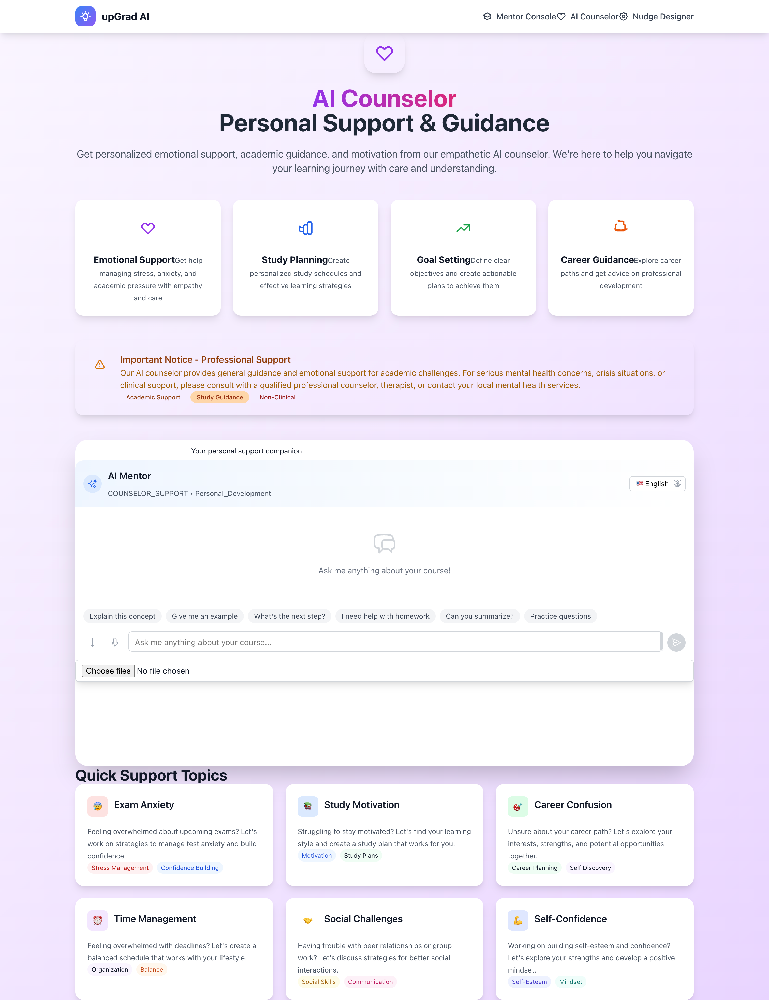

# Hackathon Project

A full-stack application with React frontend, FastAPI backend, and AI integration capabilities.

## Screenshots

The application features a modern, responsive interface with multiple pages and AI-powered functionality:

### Home Page


_Main landing page with navigation and overview of available features_

### AI Mentor Interface


_Interactive AI mentor chat interface with real-time responses powered by Ollama_

### Custom Nudge System


_Personalized notification system for student engagement and support_

## Architecture

- **Frontend**: React + TypeScript + Vite
- **Backend**: FastAPI (Python 3.11+)
- **Database**: MySQL (for tickets and user data)
- **Vector Database**: Qdrant (for embeddings)
- **AI/LLM**: Ollama (local inference)
- **Containerization**: Docker Compose

## Project Structure

```
hackethon/
├── src/                    # React frontend source
│   ├── components/         # React components
│   │   └── ChatWidget.tsx  # AI chat interface
│   ├── pages/             # Application pages
│   │   ├── Home.tsx       # Home page (/)
│   │   ├── Mentor.tsx     # Mentor page (/mentor)
│   │   └── Counselor.tsx  # Counselor page (/counselor)
│   ├── App.tsx            # Main app component
│   └── main.tsx           # Entry point
├── backend/               # FastAPI backend
│   ├── main.py           # FastAPI application
│   ├── run.py            # Uvicorn run script
│   ├── requirements.txt  # Python dependencies
│   ├── Dockerfile        # Backend container
│   └── init.sql          # Database initialization
├── docker-compose.yml    # Multi-service orchestration
├── Dockerfile.frontend   # Frontend container
├── env.example          # Environment variables template
└── README.md            # This file
```

## API Endpoints

- `POST /api/ai/ask` - AI chat interface
- `GET /api/tickets` - Retrieve support tickets
- `POST /api/tickets` - Create new support ticket
- `POST /api/embeddings` - Generate text embeddings
- `POST /api/nudge` - Send user notifications

## Quick Start

### Prerequisites

1. **Docker & Docker Compose** - For containerized services
2. **Ollama** - For local AI inference
   ```bash
   # Install Ollama (visit https://ollama.ai for platform-specific instructions)
   # Then pull a model:
   ollama pull llama2
   # Start Ollama service:
   ollama serve
   ```

### Development Setup

1. **Clone and setup environment**:

   ```bash
   git clone <your-repo-url>
   cd hackethon
   cp env.example .env
   # Edit .env with your configuration
   ```

2. **Start all services**:

   ```bash
   docker-compose up --build
   ```

3. **Access the application**:
   - Frontend: http://localhost:3000
   - Backend API: http://localhost:8000
   - API Documentation: http://localhost:8000/docs

## Database Setup

The application uses MySQL for persistent data storage. The database setup is automated, but you can also set it up manually:

### Automated Setup (Recommended)

```bash
cd backend
./start.sh
```

### Manual Database Setup

```bash
cd backend

# Create virtual environment
python3 -m venv venv
source venv/bin/activate

# Install dependencies
pip install -r requirements.txt

# Setup database (creates tables and imports schema)
python setup_database.py

# Start the server
python main.py
```

### Database Configuration

The database configuration is managed through environment variables in `.env`:

- `DB_HOST=localhost`
- `DB_PORT=3306`
- `DB_USER=root`
- `DB_PASSWORD=your_password`
- `DB_NAME=hackathon_db`

### Database Schema

The application creates the following tables:

- `tickets` - Support ticket management
- `users` - User account management
- `chat_sessions` - Chat session data storage
  - Qdrant Dashboard: http://localhost:6333/dashboard
  - MySQL: localhost:3306

### Manual Development (without Docker)

1. **Frontend setup**:

   ```bash
   npm install
   npm run dev
   ```

2. **Backend setup**:

   ```bash
   cd backend
   pip install -r requirements.txt
   python run.py
   ```

3. **Database setup**:
   ```bash
   # Start MySQL and Qdrant manually
   # Update connection strings in .env
   ```

## Environment Variables

Copy `env.example` to `.env` and configure:

- **Database**: MySQL connection details
- **AI Services**: Ollama URL and model configuration
- **API Keys**: External service credentials
- **Security**: Secret keys for JWT and encryption

## Features

### Current Implementation

- ✅ React frontend with TypeScript
- ✅ FastAPI backend with async support
- ✅ Docker Compose orchestration
- ✅ MySQL database with sample schema
- ✅ Qdrant vector database integration
- ✅ Chat widget component
- ✅ Multi-page routing (Home, Mentor, Counselor)
- ✅ API endpoints for all core functionality

### Completed Integration Tasks

- ✅ Connect ChatWidget to FastAPI backend
- ✅ Implement Ollama integration for AI responses
- ✅ Set up MySQL ORM models and CRUD operations
- ✅ Configure Qdrant for embedding storage and retrieval
- ✅ Add user authentication and session management
- ✅ Implement real-time notifications/nudges
- ✅ Add error handling and logging
- ✅ Create database migrations
- ✅ Add unit and integration tests
- [ ] Set up CI/CD pipeline

## Development Commands

```bash
# Start all services
docker-compose up --build

# Start only specific services
docker-compose up frontend backend

# View logs
docker-compose logs -f backend

# Stop all services
docker-compose down

# Reset database
docker-compose down -v
docker-compose up postgres

# Frontend development
npm run dev          # Start dev server
npm run build        # Build for production
npm run lint         # Run ESLint

# Backend development
cd backend
python run.py        # Start FastAPI server
pip install -r requirements.txt  # Install dependencies
```

## Troubleshooting

### Common Issues

1. **Port conflicts**: Ensure ports 3000, 8000, 3306, 6333 are available
2. **Ollama connection**: Verify Ollama is running on localhost:11434
3. **Database connection**: Check MySQL credentials in .env
4. **CORS issues**: Frontend and backend URLs must match CORS configuration

### Logs and Debugging

```bash
# View all service logs
docker-compose logs

# View specific service logs
docker-compose logs backend
docker-compose logs frontend

# Enter container for debugging
docker-compose exec backend bash
docker-compose exec frontend sh
```

## Contributing

1. Fork the repository
2. Create a feature branch
3. Make your changes
4. Add tests if applicable
5. Submit a pull request

## License

[Add your license information here]

OLLAMA_BASE_URL=http://localhost:11434
QDRANT_URL=http://localhost:6333
EMBEDDING_MODEL=bge-large
CHUNK_SIZE=1000
CHUNK_OVERLAP=200

# Basic usage

python scripts/ingest_content.py --input-dir ./content

# Advanced usage with custom settings

python scripts/ingest_content.py \
 --input-dir ./docs \
 --chunk-size 600 \
 --module "course-materials" \
 --api-url http://localhost:8001 \
 --max-concurrent 10 \
 --verbose

# Dry run to test without uploading

python scripts/ingest_content.py --input-dir ./test_content --dry-run
